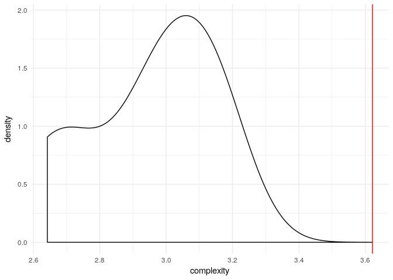

# Food Webs: it's not easy with this complexity.
All of contributors  
16 November 2016  


> If no one ask of me, I know; if I wish to explain to him who asks, I know not.
> Saint Augustin, _Confessions_, Book 11

# Are Food Webs complex?

Ecologists have been wondering about the complexity of food webs and seem to agree: 208 articles claims that "food webs are complex", and an additional 5260 mention "complex food webs" (in comparison, 43 articles mention them as being "simple" and 1070 find "simple food webs" --- and this is usually _relative_ to more complex food webs [@jonsdottir2005terrestrial]). The notion underlying the common claim stems from recognising that ecosystems, described in terms of ecological networks, are the outcome of evolutionary and ecologic processes --- not merely _random_ structures. Thus, we nurture an _expectation_ for them to be significantly more _complex_ of what expected under some _null model_. As a corollary, we may _expect_ ecological networks' complexity to be higher in system that are the outcome of more complicated, long, or strong, evolutionary and ecologic processes.

However, the popularity of the term has not, so far, been supported by a rigorous analysis of its meaning. In fact, it is hard to find any discussion of what it _means_ to be complex in the papers mentioning complexity. Whenever a certain metric has been adopted adopted, the choice is rarely argumentated: how does that particular metric measures complexity? Is said metric a direct measurement or a proxy for complexity? And, if it is a proxy, under which condition is it a _good_ proxy?

Because of this vague and implicit definition, _complexity_ has been used as an umbrella to refer to many different, sometime conflicting, concepts. So, we find system that are said _complex_ because **numerous** (they are made of many parts: many species, many interactions, ... ), because they have a **disordered** structure (they do not exhibit regular topologies), because they exhibit **chaotic** behaviours (it is hard to predict their dynamics). None of these terms is strictly equivalent to another; nor their equivalence has been explicitly shown for ecological systems.  None of them in isolation is sufficient to distinguish a complex system from a simple system. However, numerousity, disorder, chaos, (and other characteristics), all concur to determine a complex system. Similarly, most popular ways of quantifying complexity, and thus to compare the complexity of an observed ecosystem to another or to a null model, are actually measures of either numerousity, disorder, chaos. Thus, we risk to offer biased comparison and not to be able to discern significant and non significant complexities.

With this in mind, we review and systematise some of the various heuristical conceptualizations of ecosystem complexity, focussing in particular on ecosystem represented as trophic interaction networks (e.g., predator--prey or consumer--resource food webs). Moreover, we introduce rigorous definitions of graph complexity in the ecological scenario, presenting both deterministic (Kolmogorov) and probabilistic definitions. We discuss how the heuristic definition may be related to the more rigorous definitions.

To ground the discussion we put to test the main notion --- namely, that ecological networks are significantly complex. To do that, we adopt from the graph theory literature a restricted set of rigorous graph complexities metrics, which we believe are ecologically meaningful and relevant. Then, we identify proper null model distributions of ecological networks. Finally, we compare the complexity of a large ensemble of observed ecological networks with the complexity of their randomized counterparts.

# Perceiving complexity

## Operational complexity

The complexity of an object depends on our description of it. On the one hand, the neuronal blue print of our brain is extremely intricated; on the other hand, it is just a large but not exceptional amount of protons, neutrons and electrons --- not dissimilarly by a concrete block of roughly the same size ---; and if we had described it just by its size and volume we wouldn't be able to distinguish it from a watermelon.

In exactly the same way, the level of detail with which we describe an ecosystem --- our choice of which elements to include or ignore in the description --- will determine how much complex the ecosystem will look to us. Here we will consider ecosystem as described by ecological interaction networks, i.e., trophic networks or food webs.

The graph representations of food webs are abstractions: they do not exist, as such, in nature; *building* graph representations involves a number of choices. We need to enclose ecosystems within spatial and temporal boundaries (e.g., we may be interested in one morning snapshot of one person's gut microbial community, or in the pollination network of flowering plants in the Po valley during spring); we need to group individual --- or not (the nodes in our graph can represent individuals, species, guilds, OTUs, ...); we need to categorise interactions (predation, commensalism, pollination, ...) and select them (we may observe on one or more of those categories); if we decided to group individuals and/or interactions, we would need to assign them to groups and/or interactions to categories; even before that, we need to observe --- and maybe sample --- individuals and detect interactions (directly or through the study of the relevant literature).

All this tasks add both uncertainty and arbitrarity to the building process. Choices made in one system can be hardly compared to the choices made in a different system. The operational issues encountered depend on system specific factors --- and researchers in a field may fail to recognize the specific issues exhisting in other fields.

This *complications* constitute the first facet of complexity encountered by ecologists when dealing with food webs. In other words, **food webs are complex because they are hard to put together**. We name this **operational complexity** The challenges of managing and analyzing  data generated from genetic/genomic techniques is often at the forefront of what microbial ecologists refer to when they invoke complexity.

However problematic this complications are, they do not *necessarily* translate into the other facets of *complexity* we will discuss in the following paragraph. Food webs that are very hard to study may exhibit (or not) a remarkable simple structure once finally unveiled. Moreover, given that many choices are grounded on a specific knowledge of the systems being studied, they don't seem a sound terrain on which to compare food web complexities across systems: operational complexity is extremely _operator dependent_.

Yet, let's not dismiss operational complexity too hastly. In fact some of its sources and consequences link into two other facets of complexity we will analyse in the next two sessions.

A trophic network can be operational complex because it is constituted by a very large number of elements, interactors and interactions. We refer to this as **numerosity**. A network that can never be quantified obscures our ability to make and test predictions about its future, in other words, it can be largely **unpredictable**.

## Numerosity

A tempting request we can express to any definition of complexity is that, everything else being equal, the complexity of an object should grow if we add more element to the object. That is, our measure of complexity should be a monotonic increasing function of the number of elements of the objects.

This is in line with May's definion of complexity as the **connectance** of a food web --- its link density. It is, indeed, natural to think that food webs involving more species should be more complex; and given a fixed number of species, food webs with more interactions should be more complex.

Notice that connectance (and the similar measure of link density) is blind to the structure of the trophic network. It takes into account _how many_ interactions are there, but not who interacts with who.

## Unpredictability

In López-Ruiz et al., the authors propose to define the complexity of a physical phenomena as "the interplay between the information stored in the system and its disequilibrium". Here, we consider the two components autonomously, discussing the **informational** component of a food web complexity in the **Structure complexity** session, and the **dynamical** component here.

Food webs are not, in general, static. Demographic dynamics are a source of additional complexity. We identify the dynamical complexity of a food web with the complexity of its dynamic attractor.

<!-- We need help from Leo here! -->

## Process complexity

# Structure complexity

All the previous facets of complexity are extremely important for the ecologists, and can be readily interpreted: we can relate to the operational struggle, we can count species, we consider predictability important for many good reasons, we appreciate the complexity of the ecological and evolutionary processes. Yet, operational and process complexity, and unpredictability are difficult to quantify exactly, while it is not clear if counting OTUs in a microbial community is the same activity of counting species in the Serengeti. The previous complexities make comparing different food web complexities hard.

On contrary, complexity metrics based on the shape of the interaction networks themselves are adopted because they seem to be directly comparable between system. Yet, adopting metrics straight graph, electrical network, or social network theories meanse that their interpretation is arguably straightforward. We know how to measure it, but what does it mean? When is the structure of a network _complex_?

## The topology

The information complexity of an observed food web can be summarised as the amount of information needed to specify its structure, that is, the distance between the observed food web and the most likely random food web

<!--- XXX this is to check carefully --->


### Are food webs topologically complex?

The claim that food webs are complex can be expressed as the hypothesis that the informational and dynamical complexity of observed food webs is higher than that of simulated food webs sampled from a relevant null distribution.

So far, the literature about food web complexity operated only through statistical indexes (such as connectance or species richness), assumed as proxies for complexities.
igraphdata
Here, we test wether food webs are significantly complex, across a variety of informational complexities measures and randomization techniques.

#### Data

Let's start with a toy example: food webs from the `igraph` package.


```r
suppressMessages(source("./R/Reqs.R"))
```

We use the food webs contained in the `foodwebs` dataset provided by `Igraphdata`.

> See references for the individual webs above. The data itself was downloaded from [Vlado's website](http://vlado.fmf.uni-lj.si/pub/networks/data/bio/foodweb/foodweb.htm).

To compute the information theoretic indexes we need to transform the _Igraph_ web objects to _graphNEL_ objects. We do it using the ancillary function `directed_to_graphNEL()`.


```r
data(foodwebs)
web_list <- plyr::llply(foodwebs, directed_to_graphNEL)
```

Maybe some plot, just because everybody loves hairy balls.

#### Methodology

To illustrate the analytic flow without compromising our results with an implicit bias, we are going to use an unnamed complexity function sampled from the 23 provided by `QuACN`.


```r
cpl_foo <- random_complexity_foo(compl_list)
```

We can compute the complexity of any of the observed food webs:


```r
test_fw <- sample(web_list,size=1)
name_fw <- names(test_fw)
test_fw <- test_fw[[name_fw]]
test_fw_cpl <- cpl_foo(test_fw)
```

We find that the CrystalC food web has a complexity of 3.6216535. Now, we can test wether that complexity is significantly higher (or lower) than wha we find in a _random_ food web. To do this, we have to define a randomization function, that performs a rewiring of the observed food web preserving some of its properties. The choice of the properties to preserve is an essential component of the analytic flow.


```r
random_fw <- g_NE_r(test_fw) # random ER graph with the observed number of nodes and (undirected) edges
random_fw_cpl <- cpl_foo(random_fw)
```

And we can test whether the complexity index of the observed web is lower of the randomized one. In this is case it's higher.

We can build that into a significance test for the complexity of the observed network.


```r
Replications <- 10
random_fw_cpl_array <- replicate(Replications,cpl_foo(g_NE_r(test_fw)))
empirical_p <- sum(random_fw_cpl_array >= test_fw_cpl) / Replications
```

#### Results

Are empiracally observed food webs significantly more complex, from an information theoretic point of view, than their random counter part?

In this case, the 0% of the randomized webs have a higher complexity (as measured by `cpl_foo`) than the observed one. Thus, we say that the observed web is significantly complex, with respect to the randomization algorithm and the complexity measure we adopted. We can also have a look at the distribution of the complexity measure we computed over the randomized webs we simulated.


```r
ggplot(data.frame(complexity = random_fw_cpl_array),
       aes(complexity)) +
  geom_density() +
  geom_vline(xintercept = test_fw_cpl, colour = "red") +
  theme_minimal()
```

<!-- -->

Is any of the common proxies (such as connectance, the number of species, ...) correlated with the information complexity of the webs?

# Discussion and Conclusions

## Limitations

### Not all interactions are equal

The different relevance of single interactions in the web --- the interaction _weights_ ---  are important for the demographic dynamics and the stability of the webs (e.g., see [Dambacher et al.](http://onlinelibrary.wiley.com/doi/10.1890/0012-9658(2002)083[1372:ROCSIA]2.0.CO;2/full) and the more recent but more technical [Koslicki & Novak](http://biorxiv.org/content/early/2016/10/25/083089)). The measures of structural complexities we tested numerically are blind to edge weights. This possible source of food web complexity is still largely ignored, in part due to the difficulty of gathering the necessary data to establish interaction weights.

## Relevance: why do we care...

### ...about information content?

<!--- Maybe something about Watson and Szathamary and learing in ecosystems --->
